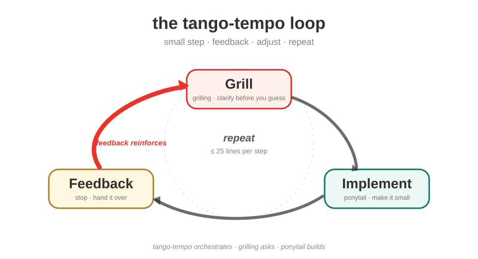

# TangoTempo

<div align="center">


[English](./README.md) · **简体中文**

> 让它像两支舞步一样咬合——实现一小步、理解一小步，*没有对方的反馈，谁都不迈下一步*。

[](./LICENSE)
[](./README.md)

</div>

## 这是什么

**TangoTempo** 是一套 **AI Agent 技能（skills）**，让编码 agent 和你的节奏始终咬合——小步快跑、即时反馈、永不空转。四个技能、一个循环、三个生态：同一份 `SKILL.md` 在 **GitHub Copilot**、**OpenAI Codex** 和 **OpenCode** 上原样运行（也兼容 Claude Code、Cursor 等更广的 Agent Skills 生态）。

> **为什么** —— 一次性大 prompt 一口气做完，下一口气就脱节。TangoTempo 换一种玩法：agent 迈一小步就交回来，收到你的反馈才继续。它定义的是工作的**节奏**，不是一段提示词。

## 工作机制



循环尽可能小：**澄清**（grilling 追问）任何含糊需求 → **实现**（ponytail）最小的一步（净增 ≤ 25 行）→ **停下，交回给你反馈**。如此往复。一旦 agent 的理解和你的理解出现偏差，它回到追问环节重新对齐，而不是继续硬推。

## 技能一览

| 技能 | 归属 | 调用方式 | 作用 |
|---|---|---|---|
| `tango-tempo` | **自研 —— 本仓库核心** | 常驻（自动） | 编排器：小步咬合节奏 |
| `grilling` | 改编自 [mattpocock/skills](https://github.com/mattpocock/skills)（MIT） | 自动（带 `grill`）或经 `grill-me` | 访谈：设计树、轮次、前沿问题、推荐答案 |
| `grill-me` | 来自 [mattpocock/skills](https://github.com/mattpocock/skills)（MIT） | 仅用户（`/grill-me`） | 入口 —— 发起一次 grilling 会话 |
| `ponytail` | 改编自 [DietrichGebert/ponytail](https://github.com/DietrichGebert/ponytail)（MIT） | 自动 + `/ponytail lite\|full\|ultra` | 写出真正能用的最懒解 |

## 安装

**方式一 —— 一条命令，装进三个生态**（需 GitHub CLI 的 `gh skill`，预览版）

```bash
gh skill install LeiChen9/TangoTempo --all --agent github-copilot --agent codex --agent opencode
```

- 加 `--scope user` → 装到所有项目。
- 加 `--scope project` → 装进当前仓库的 `.agents/skills/` —— 该目录被 Copilot、Codex、OpenCode 共享，装一次三边生效。

**方式二 —— OpenCode 用 skills.sh**

```bash
npx skills add LeiChen9/TangoTempo
```

**方式三 —— 手动安装**（克隆一次，把各技能文件夹软链到对应目录）

| 生态 | 个人级 | 项目级（你的仓库里） |
|---|---|---|
| OpenCode | `~/.config/opencode/skills/` | `.opencode/skills/`、`.agents/skills/` |
| OpenAI Codex | `~/.codex/skills/` | `.agents/skills/` |
| GitHub Copilot | `~/.copilot/skills/` | `.github/skills/`、`.agents/skills/` |

```bash
git clone git@github.com:LeiChen9/TangoTempo.git ~/TangoTempo

ln -s ~/TangoTempo/skills/tango-tempo ~/.config/opencode/skills/tango-tempo
ln -s ~/TangoTempo/skills/grilling   ~/.config/opencode/skills/grilling
ln -s ~/TangoTempo/skills/grill-me   ~/.config/opencode/skills/grill-me
ln -s ~/TangoTempo/skills/ponytail   ~/.config/opencode/skills/ponytail
```

重启你的 agent —— `tango-tempo` 从第一句话就开始生效。

## 用法

- **正常用就行。** `tango-tempo` 常驻：步子小、回交勤，agent 会主动说出自己对系统的理解，让你尽早纠正。
- **`/grill-me`** —— 有了想法但还没想清楚时用。仅限用户调用，agent 不会自作主张。
- **`/ponytail lite|full|ultra`** —— 调节实现阶段抵抗过度工程的强度（默认 `full`）。
- **节奏脱节了？** 如果 agent 不断被纠正或重复自己说的话，就刻意放慢：拆更小的一步，或先追问再动代码。

## 兼容性

四份技能都是标准 **Agent Skills**（`SKILL.md` + YAML frontmatter），遵循 GitHub Copilot、OpenAI Codex、OpenCode、Claude Code 等共同支持的开放规范。

- `agents/openai.yaml` 提供 Codex / Copilot 侧的显示名与调用策略。
- OpenCode 专属 frontmatter 字段（`disable-model-invocation`）不识别它的生态会自动忽略。
- 每份技能都通过 `gh skill` 安装前的校验：`name` 等于目录名、`description` ≤ 1024 字符、声明 `license: MIT`。

## 致谢与许可

- **`tango-tempo`** 为原创 —— 本仓库核心。
- **`ponytail`** 改编自 [DietrichGebert/ponytail](https://github.com/DietrichGebert/ponytail) —— MIT，© 2026 DietrichGebert。
- **`grill-me`** 和 **`grilling`**（含其 `agents/openai.yaml`）改编自 [mattpocock/skills](https://github.com/mattpocock/skills) —— MIT，© 2026 Matt Pocock。

完整归属见 [NOTICE.md](./NOTICE.md)。

MIT © 2026 Riceball。详见 [LICENSE](./LICENSE)。